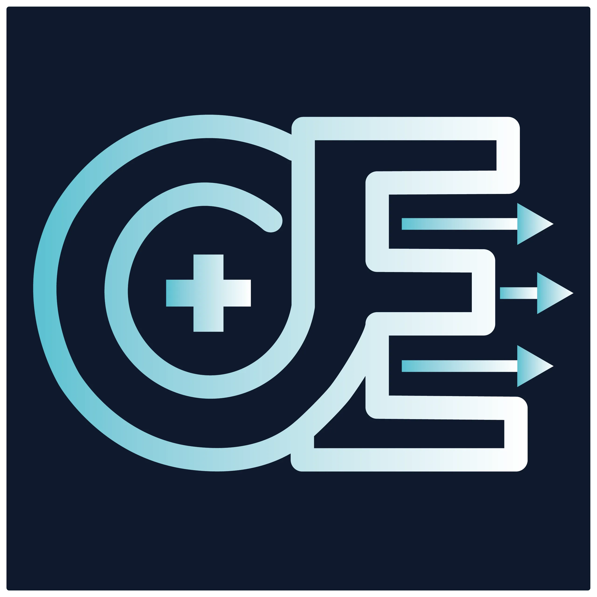
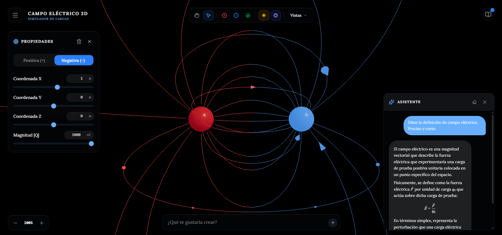

<div align="center">
  

# Campo Eléctrico 3D

**El Simulador Electromagnético Interactivo de Próxima Generación**

<p align="center">
    
    
    
    
    
  </p>

<p align="center">
    <em>Diseñado para transformar la enseñanza de la física a través de inteligencia artificial, renderizado tridimensional y matemáticas puras.</em>
  </p>
</div>

---

<details>
<summary>📸 Vista Previa del Simulador</summary>

<br>



</details>

---

## ¿Por qué existe este proyecto?

Aprender electroestática es un desafío. Tradicionalmente, conceptos como el _potencial eléctrico_, la _fuerza de Coulomb_ o las _líneas de campo_ se enseñan en pizarras planas en 2D, dejando a los estudiantes luchando por visualizar fenómenos que son fundamentalmente tridimensionales e invisibles.

**Campo Eléctrico 3D** nació para solucionar este vacío pedagógico. Nuestra misión es ofrecer a estudiantes e instituciones educativas una herramienta innovadora que haga la física **visual, interactiva y completamente inmersiva**. Olvídate de los simuladores arcaicos y limitados; aquí podrás interactuar con la física en tiempo real, respaldado por un asistente de Inteligencia Artificial que guía tu aprendizaje paso a paso.

---

## Características Principales

### 1. Renderizado 3D Inmersivo en Tiempo Real

No más dibujos estáticos. Gracias a la potencia de **Three.js** y **React Three Fiber**, el simulador proyecta el espacio vectorial electromagnético directamente en tu navegador con un rendimiento altísimo:

- **Líneas de Campo Dinámicas:** Visualiza cómo interactúan las fuerzas cuando acercas o alejas cargas.
- **Superficies Equipotenciales:** Observa las "capas" de voltaje en el espacio tridimensional y comprende visualmente dónde el potencial es fuerte o nulo.
- **Modos de Vista:** Controles de paneo, selección y vistas predefinidas (plano cartesiano, perspectiva libre).

### 2. Asistente IA + Motor de Física Predictivo

A diferencia de otros simuladores, hemos integrado un **Asistente IA** capaz de comprender lenguaje natural.

- **Matemática Determinista:** La IA no inventa los números. Cuando le pides resolver un problema, un **Motor de Física Exacto** (desarrollado en Python puro) intercepta los parámetros, calcula matemáticamente la Ley de Gauss y la fuerza de Coulomb vectorial, y le entrega los resultados absolutos a la IA para que te los explique con total precisión pedagógica.
- **Comandos de voz a acción:** Pide "Crea un dipolo", "Limpia la escena" o "Añade una carga de prueba", y la IA lo hará por ti al instante.

### 3. Componente Pedagógico Integrado

Pensado para las aulas de clase y el autoaprendizaje:

- **Quizz de Reflexión:** Evaluaciones interactivas dentro de la aplicación con animaciones dinámicas que recompensan tu progreso.
- **Introducción Guiada:** Un sistema de _Onboarding_ amigable que te enseña a volar por la escena y usar todas las herramientas en segundos.
- **Explicaciones en Formato LaTeX:** Todas las fórmulas y operaciones matemáticas generadas por el sistema se renderizan de forma hermosa y académica usando tipografía KaTeX.

---

## Arquitectura del Proyecto

Este ecosistema ha sido construido siguiendo los más altos estándares de la ingeniería de software de Código Abierto (Open Source), utilizando una arquitectura **Monorepo** administrada por **Turborepo** y **pnpm**.

```text
📦 Raíz del Monorepo
 ┣ 📂 apps
 ┃ ┣ 📂 frontend    # Aplicación Principal (React, Vite, Zustand, Tailwind)
 ┃ ┣ 📂 api         # Backend Serverless (Vercel Python, Motor de Física)
 ┃ ┗ 📂 backend     # Backend y servicios adicionales
 ┣ 📂 packages
 ┃ ┣ 📂 ui          # Sistema de Componentes UI (Shadcn/UI)
 ┃ ┣ 📂 three       # Lógica central del renderizado en WebGL (Three.js)
 ┃ ┣ 📂 store       # Manejo de Estado Global y Sincronización
 ┃ ┣ 📂 config      # Configuraciones globales compartidas (ESLint, TSConfig)
 ┃ ┗ 📂 types       # Definiciones de Tipos (TypeScript) compartidos
 ┗ 📜 pnpm-workspace.yaml
```

---

## Guía de Despliegue y Contribución

### Requisitos Previos

- [Node.js](https://nodejs.org/) (v18 o superior)
- [pnpm](https://pnpm.io/) (Manejador de paquetes oficial)
- [Vercel CLI](https://vercel.com/cli) (Opcional, para simular el backend Python localmente)

### Instalación Local

1. Clona este repositorio:

   ```bash
   git clone https://github.com/tu-usuario/campo-electrico-3d.git
   cd campo-electrico-3d
   ```
2. Instala las dependencias globales del monorepo:

   ```bash
   pnpm install
   ```
3. **Variables de Entorno:** Revisa los archivos `.env.example` en `apps/frontend` y `apps/api`. Crea un archivo `.env.local` en cada uno y configura tus claves (Ej. Supabase, Ollama).
4. Levanta el entorno de desarrollo:

   ```bash
   pnpm dev
   ```

   _El frontend estará disponible en `http://localhost:4173` o `5173`._

---

## Teoría Física Empleada

Nuestro motor de Python realiza los cálculos vectoriales basándose en las leyes fundamentales del electromagnetismo estático:

- **Campo Eléctrico ($E$):** $\vec{E} = k_e \sum \frac{q_i}{r_i^2} \hat{r}_i$
- **Potencial Eléctrico ($V$):** $V = k_e \sum \frac{q_i}{r_i}$
- **Principio de Superposición:** Sumatoria lineal de los vectores para renderizar campos netos en cualquier punto $P(x, y, z)$ del espacio paramétrico.

---

## Licencia

Este proyecto es de **Código Abierto** y se distribuye bajo la licencia **MIT**. Eres libre de utilizarlo, clonarlo y modificarlo para llevar la educación a cualquier rincón del mundo.

> _Hecho con pasión para la comunidad estudiantil, docente y open-source._
